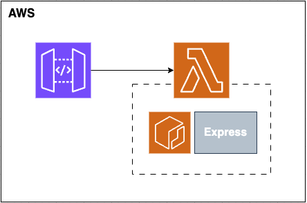

# express-template-on-lambda


```
Deploy a serverless Express project with a single command.
Have CI/CD - triggers GitHub Actions whenever push to the master branch.

- Express
- AWS Lambda
- AWS Gateway
- AWS ECR
```

#### 1. Add ".env.sh" file in "set_aws_infra_scripts"
```
# set_aws_infra_scripts/.env.sh

AWS_ID= #This variable is created automatically
AWS_ACCESS_KEY= 
AWS_SECRET_KEY= 
AWS_REGION=

DOCKER_REPOSITORY_NAME=
DOCKER_IMAGE_NAME=
ECR_ENDPOINT=$AWS_ID.dkr.ecr.$AWS_REGION.amazonaws.com/$DOCKER_REPOSITORY_NAME

LAMBDA_ROLE_NAME=
LAMBDA_FUNCTION_NAME=
LAMBDA_POLICY_ARN=arn:aws:iam::aws:policy/service-role/AWSLambdaBasicExecutionRole

API_GATEWAY_ID= #This variable is created automatically
API_GATEWAY_NAME=
API_GATEWAY_STAGE=
```

#### Fill content .env.sh
|<span style="font-size: 12px">KEY|<span style="font-size: 12px">VALUE|
|------|------|
|<span style="font-size: 12px">AWS_ACCESS_KEY|<span style="font-size: 12px">AWS IAM user access key|
|<span style="font-size: 12px">AWS_SECRET_KEY|<span style="font-size: 12px">AWS IAM user secret key|
|<span style="font-size: 12px">AWS_REGION|<span style="font-size: 12px">AWS Region (ex, ap-northeast-2)|
|<span style="font-size: 12px">DOCKER_REPOSITORY_NAME|<span style="font-size: 12px">Name to use for ecr|
|<span style="font-size: 12px">DOCKER_IMAGE_NAME|<span style="font-size: 12px">Name to use for docker image|
|<span style="font-size: 12px">LAMBDA_ROLE_NAME|<span style="font-size: 12px">Name to use for iam lambda role|
|<span style="font-size: 12px">LAMBDA_FUNCTION_NAME|<span style="font-size: 12px">Name to use for lambda function|
|<span style="font-size: 12px">API_GATEWAY_NAME|<span style="font-size: 12px">Name to use for apigateway|
|<span style="font-size: 12px">API_GATEWAY_STAGE|<span style="font-size: 12px">Name to use for apigateway deploy stage|

</br>

#### 2. Run "main.sh"
```
sh ./set_aws_infra_scripts/main.sh
```
`main.sh` : Set initial aws infrastructure

- Make **ecr** and Push first docker image to ecr
- Make **lambda** with docker
- Make **apigateway** and invoke lambda
  
<br/>

#### 3. Test Request
```
curl --request GET https://$API_GATEWAY_ID.execute-api.$AWS_REGION.amazonaws.com/dev/hello
```

<br/>

#### How to clear AWS resource
```
sh ./set_aws_infra_scripts/clear.aws.sh
```

<br />

#### How to local test
- Add `.env` file and Fill below content
```
# .env

NODE_ENV="local"
```
```
$ npm i
$ npm run dev
```
<br />

#### How to local deploy
- Excute `.deploy.sh` file
```
$ sh ./deploy.sh
```
